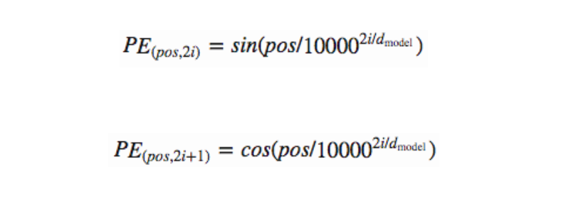
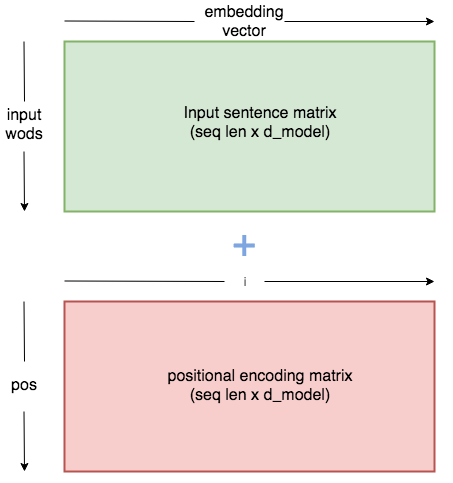
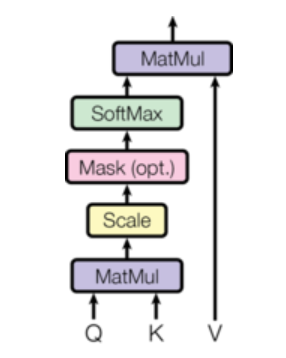
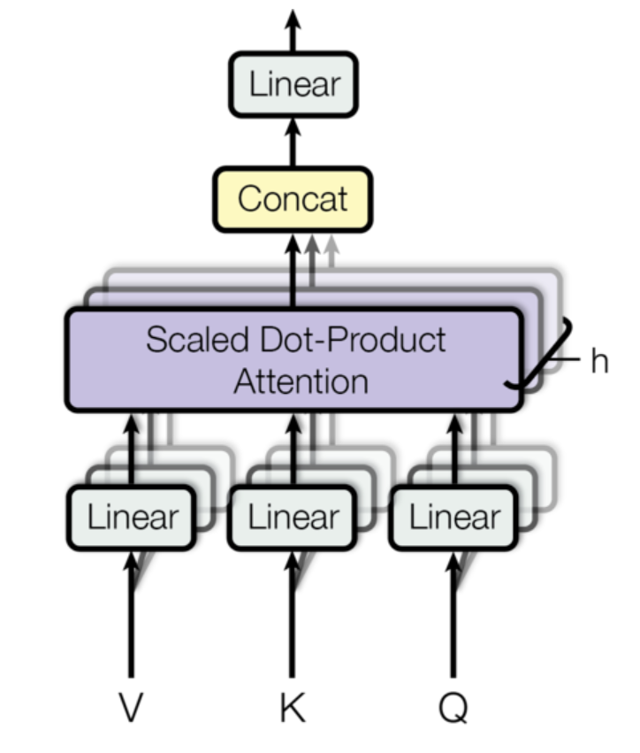
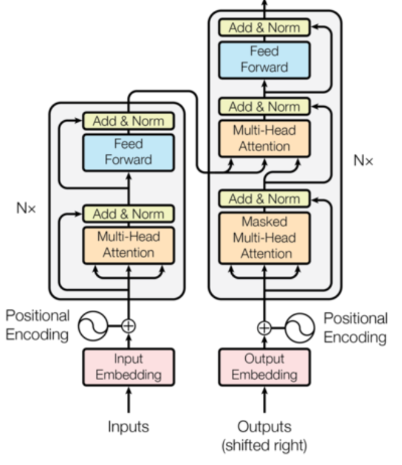

# Exploring transformer network architecture
Note: Heavily inspired by the research paper attention is all you need : https://papers.nips.cc/paper/7181-attention-is-all-you-need.pdf

Debrief my 2 weeks journey of exploring transformer

**1: Introduction and motivation**

When I was a little kid, the one day I look forward to the most within a year is my birthday, because my dad would take me to this aeroplane model shop and let me pick any plane model I like to be my present. I still remember the joy and excitement taking home my first F-14 jet model to assemble, but not so much about the 2 hour commute and 6 total switches on transit bus. Compare to more than 2 decades ago, we live in a quite different world now where things no longer come that difficult. But how often do we slowed down out steps and ponder about what was actually important to us as human but could easily left out when things around us are fast and accessible.

It is no different in the world of machine learning community known for being open source, starting from things as simple as a linear regression, to models as formidable as BERT or XLNet that can include millions, billions of parameters, can all be called with a single line of code using imported library to fit our data for prediction. This has no doubt attracted a wider range of users to apply these technologies on all sorts of interesting problems, but how many remains with the curiosity to explore the underlying theory and details of how these algorithm actually work when the understanding of the model can be highly abstracted without affecting its usability ? Is it actually worth the time to unveil the implementation detail of a transformer model and how much value can you get out of that?

Looking back on this journey of uncovering the mystry of transformer, it isn't smooth at all, for many day and nights I left my Ubuntu and GPU on just for training the model however the result was often disappointing. I started feeling frustrated and began doubt, questioning myself if all these effort and time I put in is worth it. In the end, despite the suffer, I do not regret at all because I was able to gain some priceless lessons that I did not know or even think about before. I hope to distribute away the mistakes and challenges I ran into to help the community.

**2: Implementation process**

After reading, in my opinion, one of the best papers written: Attention is all you need, I&#39;ve broken down the implementation into several parts. 1: The embedding layer. 2: The attention components. 3: The encoder and decoder components. 4: The train and evaluation environment to bring the model and dataset in. Putting these things together will give me a complete program to train and run transformer model on my English to Spanish translation dataset.

2.1: Starter code package

As a starter code package, I brought in the vocabulary class, as well as the train, evaluate and decoding algorithm I used in my Seq2Seq NMT with LSTM and attention project that obtained 32 BLUE score on EN to ES translation, thus I know I&#39;m starting on a framework that works.

- The vocabulary class provides utility services such as generating training word dictionary for both source and target language, word dictionary ID lookup, tokenizing batch sentences into IDs for model input ingestion.
- The train and evaluation code comes with batch iteration, hyperparameter configuration, optimizer initialization, load from last saved checkpoint restoration, learning rate decay mechanism, loss and perplexity calculation thus saved lots of development time.
- The decoding algorithm is a complete beam search for LSTM decoder, thus there&#39;s the need to fine-tune it based on transformer decoder output since the dimensions and re-iterating parameters are quite different.

2.2: Input embedding

The embedding of transformer encoder and decoder are both consisted with 2 parts, the first is a conventional sentence level word embedding that maps input with ( batch size, sentence length ) onto the embedding space. There&#39;re different options for this such as: jump start with pre-trained contextual free word embedding such as Word2Vec, GloVe ; bring in contextual representation from ELMo or pre-train BERT; or just initialize the weights based on embedding dimension and keep updating as we train. Here I picked the last option for simplicity. The next is a positional embedding part and in my opinion it is very important.

Transformer uses multi-head attention with mask which we&#39;ll cover in detail later, to read its input altogether without the sequence relation that we see in RNN based models. Thus at any given time step, transformer can see all its input. Positional embedding is used to inject information about the relative position of each word within the sentence so transformer can make sense with it even with self-attention based mechanism.

The equation of doing so relies on trigonometry functions sine and cosine since they&#39;re periodic functions. The idea is to construct a positional embedding matrix with the exact same shape as the input embedding matrix and concatenating them together to form the input tensor that goes into the transformer encoder, or decoder.

2.3: Attention inside transformer

It could take an entire report to introduce the attention mechanism used in transformer, I&#39;m going to abstract that out and focus on discussing the assemble of attention output. Based on below image, three inputs are required to compute attention head: Query for Q, Key for K, Value for V. The attention function maps query, onto a key-value pair in order to compute how much attention should the query place onto the key and value. This concept is very similar to the traditional dot product attention, first compute a probability distribution using softmax over the dot product of query against the key as similarity calculation, and then multiply with the value to get the attention output.

In the case of self attention, since Q, K and V includes information of the entire input, transformer requires an attention mask here to prevent its input self attends to other inputs that&#39;re not applicable. In the case of encoder, this mask serves the purpose of a padding mask to zero out input positions that are just paddings. In the case of decoder, this mask serves both as padding mask, also as an attention mask to stop decoding input from seeing its future when predicting the next word ( prevent decoder cheating ).

 

Multi-head attention sounds difficult but it&#39;s intuitively simple. After taking the query, key and value as input tensor of shape: ( batch\_size, sentence length, hidden dimension ), first linearly project each onto its projection space, and second, break the last dimension of the tensor into K number of heads and send to scaled dot product attention to compute output. What this looks like is for example, the Query projection is of shape ( batch=2, sentence\_length=20, hidden\_dim=256 ), then after spliting into 8 heads, this tensor will turn into ( batch=2, sentence\_length=20, number\_heads=8, head\_hidden\_dim=32 ) and of course, the sentence\_length and number of heads dimension are required to swap. Last is to concatenate the attention output of multiple heads into a single tensor then go through an output linear projection layer to obtain attention layer output.

2.4: Transformer encoder and decoder:

Implementing encoder and decoder are somewhat straightforward based on the transformer diagram. What should be careful with is the input and output tensor dimension when connecting all the layers as well as adding layer normalization, residual skip connection and dropout regularization among them. I first created encoder layer and decoder layer representing one transformer block, then added capability to stack multiple of them in the encoder, decoder class.

The only point worth noting is probably when connecting the encoder to decoder attention. This is an attention mechanism similar to the seq2seq with LSTM attention where the context, represented by key and value pair, comes from the encoder output, while the query comes from the decoder. This is one attention function that joins encoder output and decoder input from the previous masked multi-head attention.

I do not recall the original paper mention about adding dropout regularization, during my experiment I noticed that adding dropout helped with reducing overfit to training data slightly that&#39;s why I added dropout in both the encoder and decoder while connecting the residual skip connection before doing the layer normalization.

**3: Challenges, Mistakes, lessons**

Underestimating the importance of having a good GPU for such on-prem deep learning development is probably my biggest mistake. While transformer replaced the recurrence relation with self attention to allow parallel training process and longer range dependency capture, it also increased the total number of parameters to train depending on the number of stacked transformer layer, dimension of the hidden space and the number of splitting attention head. My GeForce GTX 750 Ti has served me very well even for my YOLO v3 project, however it has finally crumbled in front of the might of transformer and I can not fit even 1 batch of sentence into the GPU memory. To barely get the training kicking off, I had to lower the hidden dimension from 512 to 256, and the transformer layer from 6 to 2. At the cost of model going underfit my training data and is basically un-usable. This gave me the motivation to finally bite the bullet and ordered from CanadaComputer that dream graphics card I&#39;ve been always wanting: RTX 2070 Super.

Early stage testing is more important than I thought, as soon as I set up my environment and the embedding pieces, I should&#39;ve tested it with pre-built pytorch transformer API to see what I am expecting to get out of my data and hardware. One of the things I find that happens quite often but are difficult to troubleshoot is when model performed good in training, but very bad in inference. During my experiment I&#39;ve made a few implementation mistakes causing the training loss closed to almost zero, however after fixing, my model still couldn&#39;t perform up to expectation. Now I know that it&#39;s because I did not have the good GPU to unleash the full potential of a transformer model but I wish I had found this out earlier by swapping my implementation with a native torch transformer and compared the results.

Unit test is also important for modulo deep learning to make sure the dimensions click and I should&#39;ve paid more attention to the input and output dimensions throughout the model implementation and be consistent with it. My mistake is that I waited till everything is implemented and then run that training command, and what waited me is the inevitable runtime errors one after another due to tensor dimensions do not match. To fully fix this I had to insert countless print tensor shape statements everywhere in my model to debug which tensor shape was messed up. But this could&#39;ve been easily resolved if I started with more unit-testing and shape checking.

Last but not the least, having a structured class name and spell check is more important than you think. There was a time when the training was able to run, however the training loss became very huge and fail to converge even with learning rate decay, I spent about 3 days digging through my code and scratching my head trying to figure out where went wrong. And eventually the bug turnt out to be in the decoder, I swapped the positional embedding with position wise feedforward in my decoder&#39;s input layer that messed up everything. Changing this resulted in the correct training, but I spent 3 days on digging this, 3 days !

**4: Things I did not know before, but I'm glad I do now**

Positional embedding should be registered as buffer in torch once it is initialized, it should not be set up as trainable parameters. Also when constructing the matrix, it should be declared not based on batch input&#39;s longest length, but rather an absolute larger length, eg 10000, and then cut back down based on input length criteria. For more details on intuition behind positional embedding, I recommend this read: [https://kazemnejad.com/blog/transformer\_architecture\_positional\_encoding/](https://kazemnejad.com/blog/transformer_architecture_positional_encoding/)

How important getting the right mask to encoder and decoder can be to a successful implementation of transformer. There&#39;re 2 types of masks in transformer model, one is a padding mask to hide the padding in the input so that when calculating the softmax regression in multi-head attention, those padding token will not be taken into consideration. Padding mask is applicable to both encoder and decoder output. There is another type of mask called attention mask. This is often a square matrix mask of shape (sentence length, sentence length) and is used when performing masked self-attention on transformer decoder to stop any word from attending to the future words and leaking the information. Otherwise during training, since information across the entire target sentence is available to the decoder, it would know to predict by always looking at the next word. One useful function to generating such mask is to use the upper triangular matrix function: triu. This is available in both torch, and numpy. It is in a form of square matrix because after the similarity score step, the tensor is of shape ( batch size, number of heads, sentence length, sentence length ), that's when the mask is applied before taking the multiplication of this tensor to the value tensor. 

How different transformer decoder works between training and inference. Due to the nature of self-attention, transformer only need one time step to look over the entire sequence of sentence without any need for temporal recurrence. This implies that in training time, the decoder is able to take an input tensor of shape ( batch\_size, sentence length, hidden size ) and then output the exact same shape of tensor over the entire sentence, unlike LSTM which it needs to loop over each time step and then concat the previous output with the next input. However at inference time, transformer decoder would generate incremental sentence based on increasing time step and there is a need for multiple decoding runs. Given this difference, how can we build our training that makes sense ? One trick is that, the target sequence in our training data are all injected with a \&lt;start\&gt; and \&lt;end\&gt; token, and then for the target sequence input, we cut the target batch up to the last token which is \&lt;end\&gt;, and let it predict the sentence that&#39;s after the \&lt;start\&gt; token. For example, if the target sentence is: &quot; I have a dream &quot;. Then we would send &quot;\&lt;start\&gt; I have a dream&quot; to the decoder as ground truth target, and evaluate it against &quot;I have a dream \&lt;end\&gt;&quot; so it will learn to start predicting the next word after seeing \&lt;start\&gt; with the encoder output. At inference time, no matter it&#39;s beam search or greedy decoding, we would take the last predicted words in its output sentence the same way we perform auto-regressive decoding with LSTM decoder.

**5: What is the next step:**

Short term goal is to resume model training after my RTX is arrived and mounted, I&#39;m expecting a performance boost after it allows me to fit the entire 512 dimension of hidden size, the entire 8 attention heads, as well as increased batch size to train.

I&#39;m also planning on moving to my next project journey which is to explore span based question answering system with pre-trained BERT or XLNet and then go through manual tweaking for result fine tune. It&#39;s going to be a fun and interesting project.
